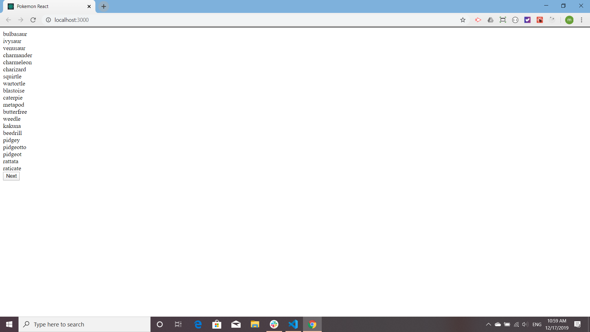
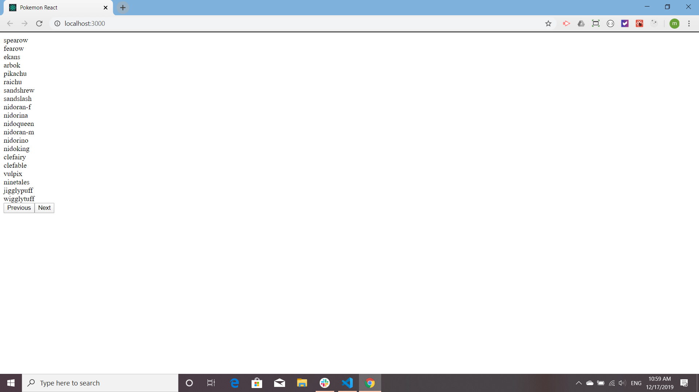

## Pokemon React!

This is a Web Dev Simplified tutorial called [Build a Pokemon Application with React Tutorial](https://www.youtube.com/watch?v=o3ZUc7zH8BE&t=41s). None of the code is mine. The tutorial covers axios and pagination. I have done pagination but with ReactRouterDom, so I found this tutorial interesting.

The app calls the pokemon API and gets a list of pokemon names. The user can then flip forward and back through the list of names, twenty per page. When there is no more pages either forward or backward the corresponding button disappears:

Another great tutorial! Thanks Web Dev Simplified!